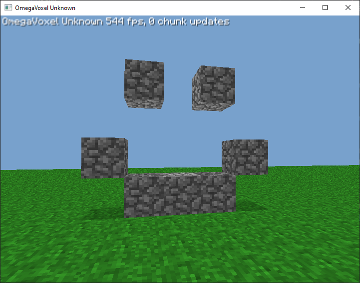
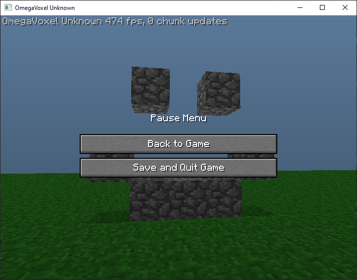
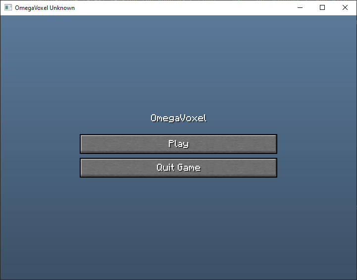

# OmegaVoxel
A work in progress Voxel engine based on Minecraft.
Currently only in Creative though I plan to make it survival after the Creative is fully fleshed out (Blocks, infinite generation?)

## Features
 * Swing UI to download and extract assets FROM the MC Beta 1.7.3 JAR, not packaged within the JAR!
 * Basic voxel rendering, full blocks only. Stone, Cobblestone, Dirt, and Grass.
 * Buttons. That's it. And labels of course
 * No hotbar or block selection, so you always have cobble.
 * Main menu, along with a nice blue sky
 * Level loading/saving with NBT

## Running
Download the latest version for your OS (`linux`, `mac`, or `windows`). Run with Java.

Note: It is best to run the JAR in a separate folder. In the working directory where the JAR is run,
a `assets` folder will be generated from the downloaded Beta JAR.

```shell
# Windows
java -jar OmegaVoxel-windows-[version].jar

# Linux
java -jar OmegaVoxel-linux-[version].jar

# Mac
# You need the -XstartOnFirstThread to run.
java -XstartOnFirstThread -jar OmegaVoxel-mac-[version].jar
```

## Screenshot
This is what it actually looks like!


